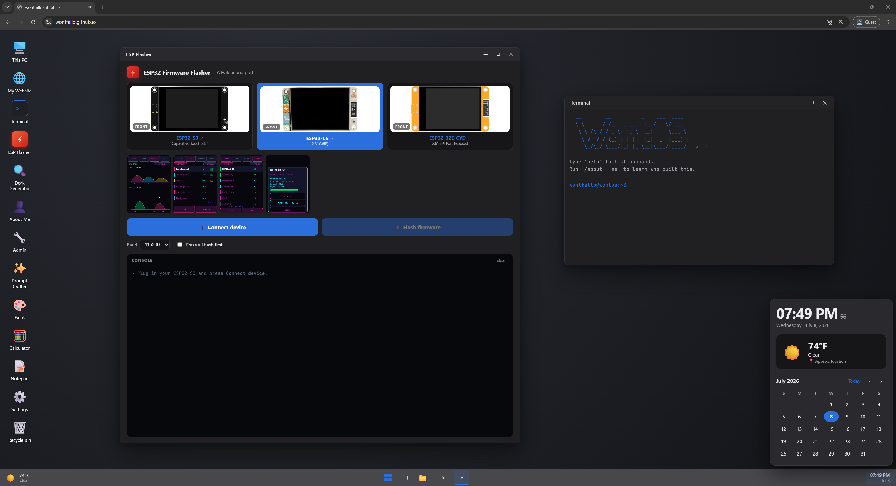

# wontfallo.github.io

WontOS — a browser desktop with a built-in ESP32 web flasher, served via GitHub Pages.




## Structure

This site was previously a single self-unpacking `index.html` bundle (~280 KB, everything
inlined as base64). It's now split into normal static files:

```
index.html              The page: the dc-runtime component tree + app script
js/
  dc-runtime.js         The dc-runtime framework (loads React from unpkg, hydrates the page)
apps/
  *.html                Iframe apps (Prompt Crafter, Admin, About Me, Dork Generator)
  doom/                 DOOM compiled to WebAssembly — see below
assets/
  *.png                 Board photos (C5, E3, S3 — front/back)
  fonts/
    jbmono-*.woff2      JetBrains Mono subsets
```

External dependencies are loaded at runtime from CDNs:

- React / ReactDOM — unpkg (pulled in by `js/dc-runtime.js`)
- esptool-js — jsdelivr/unpkg (web flasher)

Firmware images are fetched from the companion repo
[`Wontfallo/Wonthound`](https://github.com/Wontfallo/Wonthound).

## Local preview

Any static file server works, e.g.:

```
python -m http.server 8000
```

then open <http://localhost:8000>.

## Admin panel (editable content)

Open the **Admin** app (🔧) on the desktop to edit the content of the Terminal,
About Me, Notepad, and Browser apps. Default password is `admin` — **change it**
in the Security tab (it's a soft lock for a static site, not real security).

Content layering (`js/config.js`):

```
DEFAULTS (in config.js)  ←  content.json (committed, global)  ←  localStorage (your browser)
```

- **Save & apply** — stores your edits in this browser (localStorage) and reloads.
  Only you see them.
- **Export content.json** — downloads your edits; commit the file to the repo root
  to publish them for **all** visitors.
- **Reset local edits** — clears your browser overrides, back to published/defaults.

## DOOM app

The **DOOM** app (💀) runs the original 1993 shareware episode, *Knee-Deep in the
Dead*, entirely in the browser — no server, no emulator plugin. It's
[Chocolate Doom](https://www.chocolate-doom.org/) compiled to WebAssembly
(the [cloudflare/doom-wasm](https://github.com/cloudflare/doom-wasm) build),
loaded in an iframe like the other apps. Open it from the desktop, the Start
menu, or `open doom` in the Terminal.

```
apps/doom/
  index.html            App shell: canvas, loading overlay, controls bar
  websockets-doom.js    Emscripten glue
  websockets-doom.wasm  The engine (2.2 MB)
  doom1.wad             Shareware game data (4.0 MB)
  default.cfg           Key bindings / engine settings
```

Controls: `WASD` move, mouse aim, `Space` fire, `E` use, `Shift` run, `1`–`7`
weapons, `Tab` automap, `Esc` menu. Click the game so it takes keyboard focus —
if focus drifts to the window title bar, a "Click to play" prompt appears.
Sound starts after the first click or keypress (browsers block audio until a
user gesture); music is off in this build.

Licensing: the engine is GPL-2.0 and the corresponding source is published at
[cloudflare/doom-wasm](https://github.com/cloudflare/doom-wasm). `doom1.wad` is
the DOOM shareware episode, © 1993 id Software, which id permitted to be freely
distributed unmodified. The commercial WADs are **not** included — to play the
full game, drop your own `doom.wad`/`doom2.wad` into `apps/doom/` and change the
`-iwad` argument in `apps/doom/index.html`.

## Note on editing

`index.html` holds a compiled dc-runtime component tree, not hand-authored markup.
The readable app logic lives in the `<script type="text/x-dc">` block near the end of the
file. `js/dc-runtime.js` is generated ("do not edit") — don't modify it by hand.
